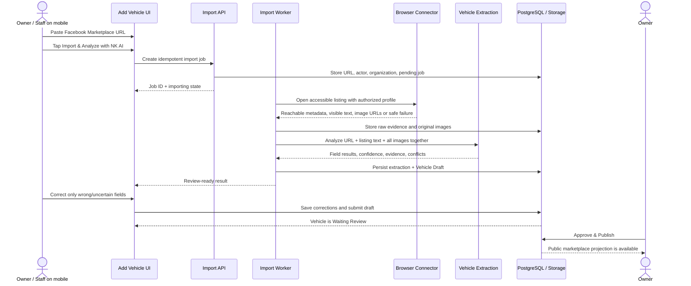

# Facebook Marketplace Import and AI Extraction

This document defines the production contract for the highest-priority NK Cars intake flow. It preserves the existing UI while replacing the prototype connector and local state with durable, observable services.

## 1. User journey

Primary path:



Fallback path:

1. Keep the pasted URL.
2. Show `Unable to import this listing automatically`.
3. Offer `Upload Screenshots / Photos` and `Paste Listing Text` immediately.
4. Accept at least 30 images in one selection and additional batches.
5. Analyze the URL context, pasted text, screenshots, and vehicle photos in one extraction.
6. Continue to the identical review/save flow.

Do not expose provider messages such as `429`, connector API responses, stack traces, selectors, cookie failures, or internal identifiers to the user.

## 2. Integration boundary

Implement an application interface, not Browserless calls scattered through UI/routes:

```ts
export interface MarketplaceConnector {
  canHandle(url: URL): boolean;
  fetchListing(input: {
    organizationId: string;
    importJobId: string;
    sourceUrl: string;
  }): Promise<MarketplaceFetchResult>;
}

export type MarketplaceFetchResult =
  | {
      status: "imported" | "partial";
      platform: "facebook_marketplace";
      canonicalUrl?: string;
      externalListingId?: string;
      title?: string;
      description?: string;
      priceText?: string;
      priceThb?: number;
      location?: string;
      sellerDisplayName?: string;
      imageUrls: string[];
      capturedAt: string;
      rawEvidence: unknown;
    }
  | {
      status:
        | "invalid_url"
        | "connector_required"
        | "login_required"
        | "unavailable"
        | "blocked"
        | "failed";
      safeReasonCode: string;
      retryable: boolean;
    };
```

The current POC uses Browserless standard Chromium Function API with an authenticated profile. Production may keep that implementation behind the interface or replace it, but must preserve response semantics and safe failure behavior.

Explicitly prohibited connector techniques:

- CAPTCHA solving or bypass
- Credential harvesting
- Automated login UI/password entry
- Fingerprint spoofing
- Proxy rotation intended to evade access controls
- Stealth or rate-limit evasion
- Access to non-public data outside the authorized session

The connector must stop and return `login_required` when Facebook presents login, checkpoint, account recovery, or two-factor UI.

## 3. URL validation and SSRF controls

Before creating a remote browser job:

- Require HTTPS.
- Allow only known Facebook hostnames such as `facebook.com`, approved subdomains, and `fb.com` share links.
- Reject usernames, passwords, explicit ports, IP literals, non-HTTP schemes, redirects to private networks, and unexpected final hosts.
- Normalize the URL and attempt to derive a stable external listing ID.
- Apply organization/user rate limits and cost caps.
- Deduplicate by normalized source URL, external listing ID, and idempotency key.

Imported image downloads must:

- Use an allowlist for known Facebook CDN hosts.
- Re-resolve DNS and block private/link-local ranges.
- Enforce redirects, content length, MIME type, pixel count, and request timeouts.
- Limit a listing to 30 retained images in V1.
- Store a checksum and perceptual hash.
- Remove unsafe metadata where feasible while retaining an original private audit object if operationally required.

## 4. Import job state machine

Canonical job statuses:

| Status | Meaning | UI behavior |
|---|---|---|
| `queued` | Accepted and waiting for worker | Importing indicator |
| `fetching_listing` | Connector is opening the listing | Importing indicator |
| `downloading_images` | Reachable images are being persisted | Progress count |
| `analyzing` | Full evidence set sent to AI | Analyzing indicator |
| `review_ready` | Draft/extraction ready | Navigate/render Review |
| `needs_user_evidence` | Automatic fetch could not supply enough evidence | Fallback upload/text UI, URL retained |
| `login_required` | Connector profile needs user re-authentication | Safe reconnect instruction for Owner only |
| `retryable_failure` | Temporary provider/network problem | Safe retry plus fallback |
| `failed` | Non-retryable safe failure | Fallback, no technical error |
| `cancelled` | User/system cancelled | Return to blank/fallback state |

Every transition records `started_at`, `updated_at`, retry count, safe reason code, and correlation ID. Store full provider error details only in protected server logs with redaction.

The UI should poll or use a realtime channel for job progress. A request must not hold a mobile browser connection open for the entire import. The operational target remains 30–60 seconds when the listing and AI provider are responsive.

## 5. Fetch and evidence capture

Retrieve only reachable content:

- Canonical source URL and external listing ID when discoverable.
- Page/listing title.
- Visible price and normalized THB price when unambiguous.
- Visible description/listing text.
- Location.
- Visible seller display information.
- Open Graph metadata.
- Up to 30 accessible listing images.
- Capture time, connector implementation/version, and source platform.

Do not use page text or DOM selectors as the only durable record. Persist normalized evidence plus a bounded, access-controlled raw evidence artifact for diagnosis/reprocessing. Do not store authentication cookies in import rows.

Persist the future-compatible source attributes requested by V1:

- `source_url`
- `source_platform`
- `source_images`
- `imported_at`
- `source_listing_text`
- `source_seller`
- `source_price`

In the normalized production model, `source_images` is a relation to stored image records rather than an unbounded inline array.

## 6. Multi-photo mobile contract

The existing input and interaction model is mandatory:

- `<input type="file" accept="image/*" multiple>`.
- At least 30 photos per selection on supported iPhone/Android photo libraries.
- One Add action selects the entire batch.
- Additional batches append to the same draft.
- Thumbnail grid appears immediately.
- Per-photo delete.
- Reorder controls or accessible drag-and-drop with reliable touch fallback.
- Cover image selection.
- All photos belong to one evidence packet/vehicle.

Production upload strategy:

1. Create an intake draft/import job and issue short-lived signed upload URLs.
2. Compress preview/client copies where useful, but retain sufficient resolution for OCR/VIN/spec labels.
3. Upload directly to private object storage with concurrency control and resumable/retry behavior where supported.
4. Persist image order, cover flag, checksum, dimensions, MIME type, original source, and upload status.
5. Start extraction only after the requested batch reaches a terminal upload state.

The prototype's browser data-URL compression is not the production storage design.

## 7. Combined AI extraction contract

All evidence for the current run is sent in one logical extraction request. If provider payload limits require batching, an application-level aggregation step must reconcile the partial observations before producing one field result set. Never present per-image guesses as independent vehicle records.

Input envelope:

```ts
type VehicleExtractionInput = {
  organizationId: string;
  vehicleDraftId: string;
  importJobId?: string;
  sourceUrl?: string;
  sourcePlatform?: string;
  listing: {
    title?: string;
    text?: string;
    priceText?: string;
    location?: string;
    seller?: string;
  };
  images: Array<{
    imageId: string;
    signedReadUrl: string;
    kind: "listing" | "screenshot" | "vehicle" | "document" | "unknown";
    order: number;
  }>;
  existingFields: Record<string, {
    value: unknown;
    lockedByUser: boolean;
  }>;
  extractionVersion: string;
};
```

Output field:

```ts
type ExtractionField<T> = {
  value: T | null;
  confidence: number;
  status: "extracted" | "need_review" | "conflict" | "unknown";
  evidence: Array<{
    evidenceId: string;
    summary: string;
  }>;
  alternatives: Array<{
    value: T;
    confidence: number;
    evidenceIds: string[];
  }>;
};
```

Required output fields:

- `brand`, `model`, `year`, `grade`
- `engine`, `engine_capacity`
- `transmission`, `drive_type`, `body_type`, `cab_type`
- `mileage`, `color`
- `vin_chassis`, `registration_year`
- `source_price`, `seller`, `source_platform`, `listing_text`, `location`, `source_url`

Evidence and conflict rules are defined in `CODEX_HANDOFF.md`. Additionally:

- OCR-derived text must link to the image/screenshot that contained it.
- VIN/chassis is sensitive and remains in internal/private storage.
- A price without a clear currency/context is `Need Review`, not silently THB.
- Year visible in title and registration year are separate facts.
- `4x4`, `4WD`, `Prerunner`, and `2WD` are not interchangeable; report evidence exactly and flag ambiguity.
- Model grade/body/cab inference from appearance alone should have lower confidence than a label/listing specification.

## 8. Non-overwrite and correction feedback

Field merge algorithm:

1. Load current field value and `locked_by_user` flag.
2. If the field is blank and unlocked, apply the AI proposal and record `source=ai`.
3. If the field contains an AI value and is unlocked, a new run may replace it only when the run is explicitly requested and provenance remains auditable.
4. If the field is user-entered or locked, retain it. Store the new AI result as a proposal/conflict, not as the active value.
5. When the user edits an AI-filled field, save a correction event and lock the active value.
6. Only an explicit `Use AI suggestion` or `Unlock for re-analysis` action may replace a locked field.

Correction records should capture old value, new value, actor, extraction run, prompt/model version, relevant evidence IDs, timestamp, and optional correction reason. This is feedback data; do not automatically fine-tune on it without a separate privacy/quality process.

## 9. Vehicle Draft creation and submission

Import/extraction creates or updates a private `vehicle_draft`. It does not publish.

`Save Vehicle Draft` must transactionally:

1. Validate organization and actor authorization.
2. Persist active field values, image order/cover, source evidence, and AI statuses.
3. Generate/assign stock number when appropriate.
4. Add or merge the source according to duplicate rules.
5. Create/update the internal Vehicle.
6. Set lifecycle to `waiting_review`.
7. Write activity events for import, extraction, corrections, and submission.
8. Return the Waiting Review route/id.

If a strong exact duplicate is found, the transaction may attach the source to the existing Vehicle instead. The user must be clearly informed. An uncertain match always creates a duplicate candidate for Owner review.

## 10. Owner approval and publication

`Approve & Publish` is an Owner-only server transaction:

- Lock the vehicle/version to prevent concurrent stale approval.
- Recheck required fields and selling price.
- Recheck at least one image/cover and public asset readiness.
- Recheck organization membership/Owner role.
- Select cheapest verified default source.
- Set status to `published` and `published_at`.
- Materialize/update the safe public projection.
- Promote/copy selected images to the public delivery boundary if using separate buckets.
- Write approval and publication activity events.
- Commit atomically or fail with no partial public state.

## 11. Current prototype endpoints

For parity reference only:

- `POST /api/marketplace-import`
  - Browserless when `BROWSERLESS_TOKEN` and `BROWSERLESS_PROFILE` exist.
  - Legacy HTTPS connector when configured.
  - Otherwise returns safe connector-required state.
  - Maximum 30 images and bounded connector response.
- `POST /api/vehicle-extract`
  - Same-origin check.
  - In-memory IP rate limit of 12 requests per 10 minutes.
  - 25 MB request cap.
  - OpenAI Responses API with strict JSON schema, `store: false`, high-detail images.
  - Default model selected through `OPENAI_VEHICLE_MODEL`.

Production must replace in-memory rate limits, browser data URLs, and synchronous-only orchestration with durable storage/jobs while preserving safe client semantics.

## 12. Security, observability, and retention

- Secrets are server-only and never returned to the client.
- Use structured logs with correlation ID, job ID, organization ID, safe status, latency, connector/model version, token/image counts, and cost metrics.
- Redact seller contacts, full VIN/chassis, cookies, URLs containing sensitive parameters, and raw provider responses from normal logs.
- Store `store:false` or equivalent for AI requests unless the Owner approves a different retention policy.
- Apply per-user, per-organization, per-IP, and global cost/rate controls.
- Use retry with exponential backoff only for retryable, idempotent steps.
- Use a dead-letter/failed state with an Owner-visible safe remediation path.
- Define retention for raw page evidence, screenshots, AI inputs/outputs, and rejected drafts.
- Back up database and object storage separately.

## 13. Environment variables

Names may be adapted to the deployment platform, but preserve these boundaries:

- `OPENAI_API_KEY` — server-only.
- `OPENAI_VEHICLE_MODEL` — versioned model configuration.
- `BROWSERLESS_TOKEN` — server-only.
- `BROWSERLESS_PROFILE` — server-only authenticated profile identifier.
- `BROWSERLESS_API_URL` — allowlisted service endpoint.
- `MARKETPLACE_CONNECTOR_URL` / `MARKETPLACE_CONNECTOR_TOKEN` — legacy adapter only; remove after migration.
- Supabase project URL, public/publishable key, and server-only service role.
- Queue/workflow and error-monitoring secrets as selected.

Never commit values. Keep separate development, preview, demo, and production credentials/profiles.

