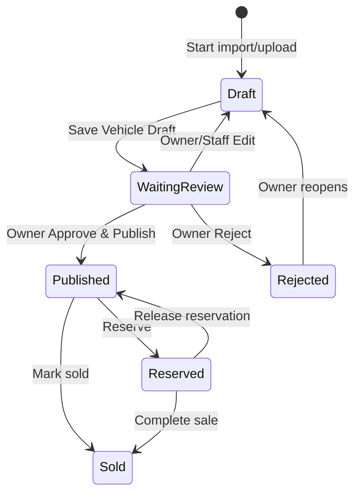

# NK Cars Platform V1 — Production Rebuild Handoff

Status: implementation specification for Codex  
Product owner: NK Cars Owner  
Current artifact: private mobile-first Sites preview  
Target: production Next.js web application  
Design directive: preserve the current UI and behavior; do not redesign without approval

## 1. Product purpose and V1 proof

NK Cars sources used vehicles in Thailand for international B2B customers. V1 must prove one complete operational loop on a phone:

> Sourcing Rules → vehicle enters system → AI reads available evidence → duplicate/reverification checks → Waiting Review → Owner Approve → Publish → Marketplace → customer selects a vehicle → NK AI Sales captures the requirement → Inquiry/Lead → Owner Dashboard

The most important intake path is:

> Paste Facebook Marketplace URL → import reachable listing data and images → AI analyzes the complete evidence set → create Vehicle Draft → user reviews/corrects → Save Vehicle Draft → Waiting Review → Owner Approve → Publish

If automatic Facebook import is unavailable, the supported operational fallback is:

> Preserve pasted URL → upload screenshots/photos and optionally paste listing text → analyze the whole evidence set → review → Save Vehicle Draft

The app must never claim an import succeeded if it did not retrieve evidence.

## 2. Preserve-the-prototype directive

The current private preview is the UI parity reference. Preserve:

- White/light canvas, dark navy/charcoal automotive B2B visual language.
- Mobile-first page composition, large imagery, rounded cards, clear badges, and large touch targets.
- Sticky header and fixed mobile bottom navigation.
- Current labels, information hierarchy, controls, empty/error states, and progressive disclosure.
- The AI-first/link-first Add Vehicle flow. A long specifications form must not be shown at the start.
- Current demo seed, DEMO DATA labelling, local demo interactions, and Reset Demo behavior in explicit demo mode.
- Existing screens and operational transitions described below.

Production may replace the single client state shell, local storage, mock AI Sales replies, and in-memory data with proper routes/services/database. That is an implementation change, not permission to redesign.

Current design tokens in `app/globals.css` include:

| Token | Value | Use |
|---|---:|---|
| Navy | `#10263d` | Primary controls, strong text |
| Deep navy | `#071725` | Hero/dark surfaces |
| Ink | `#142232` | Body text |
| Muted | `#667383` | Secondary text |
| Line | `#e5e9ee` | Borders/dividers |
| Soft | `#f4f6f8` | Page/card backgrounds |
| Blue | `#1668e8` | Information/action |
| Green | `#0b8f63` | Success/available |
| Amber | `#c97a06` | Warning/review |
| Red | `#c63f43` | Error/reject/sold |
| Purple | `#6557d8` | AI accent |

Typography is Inter/system sans-serif. Existing responsive behavior around 940, 760, 520, 410, and 390 px is part of parity.

## 3. Roles and permission contract

The prototype role selector is a demo preview control only. Production authorization must come from a trusted server-side organization membership.

| Capability | Owner | Internal Staff | Customer / anonymous |
|---|:---:|:---:|:---:|
| View all internal vehicle/source/pricing data | Yes | Yes, organization-scoped | No |
| Create vehicle/import draft | Yes | Yes | No |
| Edit vehicle before/after review | Yes | Yes | No |
| Run AI extraction/re-extraction | Yes | Yes | No |
| Resolve duplicate/source issues | Yes | Prepare recommendation | No |
| Approve and publish | Yes | No | No |
| Reject vehicle | Yes | No | No |
| Change public availability | Yes | Only if explicitly delegated later | No |
| Manage sourcing rules | Yes | Read/prepare only unless delegated | No |
| View marketplace | Yes | Yes | Published public projection only |
| Create inquiry/wanted request | On behalf of customer | On behalf of customer | Yes |
| Change lead stage/assignment | Yes | Yes, organization-scoped | No |
| View source cost, seller, URL, internal margin | Yes | Yes | Never |
| View full VIN/chassis or registration | Yes | Yes | Never; masked value only |

Hard rules:

- UI visibility is not authorization. Repeat every permission check in server-side application services and database policies.
- Owner-only state transitions are `approve`, `publish`, and `reject`.
- Staff may save corrections and drafts but cannot bypass Waiting Review.
- Customer/public responses must use a restricted public projection, not the internal vehicle row.
- All records are scoped by `organization_id`; no cross-organization access is allowed.

## 4. Navigation and screen inventory

### 4.1 Global shell

Current top bar:

- NK Cars mark/name.
- Role preview selector in demo mode; production replaces this with authenticated role/profile UI while retaining the shell dimensions.

Current internal mobile bottom navigation:

> Home | Vehicles | Leads | Wanted | More

Current customer mobile bottom navigation:

> Home | Vehicles | Wanted | Ask NK AI | More

The prototype internally switches among these views: `home`, `vehicles`, `marketplace`, `review`, `detail`, `vehicle360`, `leads`, `wanted`, `more`, `rules`, `add`, and `inquiry`. Production maps them to real routes without altering visible navigation.

### 4.2 Owner Dashboard / Home

Purpose: mobile control center, concise and actionable.

KPI cards:

- Waiting Review
- Published Vehicles
- Active Leads
- Wanted Requests
- Customer Inquiries
- Hot Matches

`Need Your Attention` items link directly to the relevant record/action:

- Vehicles waiting approval
- Possible duplicates
- Source price changed
- Vehicle possibly unavailable
- Hot vehicle matching a customer wanted request

Also show recently published vehicles. Counts must be real organization-scoped aggregates in production; demo mode uses the current seed.

### 4.3 Internal Vehicles

Inventory list for Owner/Staff:

- Photo, stock number, brand/model/year, lifecycle badge.
- Source cost, selling price, gross profit where present.
- Direct link to Waiting Review for reviewable items.
- Direct link to Vehicle 360 for operational context.
- Link to public preview for publishable/public vehicles.

Search/filter behavior should remain compact and mobile-friendly.

### 4.4 Add Vehicle / Import Vehicle

Initial new-vehicle screen is blank and contains no demo/default vehicle data.

Primary action only:

- Heading: `Import Vehicle`
- Field: `Paste Facebook Marketplace Link`
- Button: `Import & Analyze with NK AI`

Alternative actions below an `or` divider:

- `Upload Photos`
- `Paste Listing Text`
- `Clear All`

Do not show the long Vehicle Specs form at entry. Do not require manual fields before analysis.

Detailed behavior:

- A valid Facebook URL starts an import job.
- Automatic import retrieves only data/images the connector can lawfully and technically access.
- Imported text, metadata, screenshots, uploaded photos, and URL context are combined into one extraction request.
- If blocked/unavailable/login required, show the safe fallback message and keep the original URL.
- User can choose up to at least 30 images in one mobile picker action and add more batches later.
- Image grid supports thumbnails, cover selection, per-image delete, and reorder.
- Analyze all images as one vehicle, not separately.
- After extraction, show a review summary with imported images/source/source price followed by extracted fields and confidence.
- Display only fields with evidence; show `Unknown`, `Need Review`, or `Conflict` explicitly where appropriate.
- AI writes only to blank/unlocked fields. Manual edits lock the field from automatic overwrite.
- `Save Vehicle Draft` persists the draft and submits it into `Waiting Review`.

Edit Vehicle differs from Add Vehicle:

- It loads only the selected vehicle and its evidence.
- It never reuses another record or demo seed.
- Re-analysis respects manual field locks and corrections.

### 4.5 Waiting Review

Every saved intake must reach `Waiting Review` before publication.

Review must show:

- All photos and current cover
- Brand / model / year
- Specs, mileage, and color
- Source price and NK selling price
- Source name/platform, seller, source URL, last verified
- AI confidence/status/evidence at field level
- Duplicate warning, including candidate vehicle when available
- Gross profit THB and markup percentage for internal users

Actions:

- `Approve & Publish` — Owner only; disabled until required publish data and selling price are valid.
- `Edit` — Owner and Staff.
- `Reject` — Owner only; reason required in production.
- `Vehicle 360` — Owner and Staff.

Approval and publication should be one Owner action in V1 UI but a transactionally controlled domain transition in production.

### 4.6 Marketplace

Search and filters:

- Free-text search.
- Status filters: All / Available / Reserved / Sold.
- Vehicle cards with large image, brand/model/year, key specs, price, and status.

Customer-visible fields:

- Vehicle photos
- Brand / model / year
- Engine
- Transmission
- Drive
- Mileage
- Color
- NK Selling Price
- Availability

Never expose:

- Source cost
- Dealer/source name
- Seller name, phone, or contact details
- Source URL
- Internal margin/profit
- Full VIN/chassis or full registration

Public status mapping:

- Internal `Published` → public `Available`
- `Reserved` → `Reserved`
- `Sold` → `Sold`

Sold vehicles remain visible with:

- SOLD badge
- Last sold price
- Month/year sold
- Export destination country
- `Find Similar Vehicle` action

### 4.7 Public Vehicle Detail

Include:

- Large photo gallery and cover
- Specs, price, availability
- Masked VIN/chassis and registration plate if a masked value is intentionally shown
- `Ask NK AI`
- `Check Availability`
- `I'm Interested`
- `Find Similar`

Internal roles may follow an additional Vehicle 360 link. Customers cannot cross that boundary.

### 4.8 Vehicle 360

Internal operational view:

- Vehicle information and lifecycle status
- All sources and their verification state
- Default source
- Internal pricing, gross profit, markup
- Related customer inquiries/leads
- Activity timeline
- AI summary and extraction provenance
- Duplicate candidates/warnings

### 4.9 Leads

List fields:

- Customer
- Country and port
- Vehicle or wanted requirement
- Quantity and budget
- Status/stage
- Last activity
- Assigned staff

Stages:

> New → Qualified → Vehicle Selected → Availability Check → Closed

Owner/Staff can change stage. Every transition records actor, timestamp, prior value, new value, and optional note.

### 4.10 Wanted Requests

Fields:

- Model
- Year range
- Transmission
- Drive
- Body type
- Mileage
- Color
- Quantity
- Budget
- Country
- Port

Statuses:

> Searching → Matched → Customer Reviewing → Closed

Customer or internal staff can create a request. Matching may generate a `Hot Match` dashboard item, but V1 does not auto-purchase.

### 4.11 Sourcing Rules

Owner-mobile inputs:

- Brand
- Model
- Year From / To
- Maximum source price
- AT / MT
- 2WD / 4WD
- Body type
- Maximum mileage
- Color
- Province / Area
- Required keywords
- Excluded keywords
- Priority: Normal / High / Urgent
- Active / Inactive

Keep a visible Facebook/Meta integration-ready placeholder. It must not imply a live integration until configured and verified.

### 4.12 More

Compact links to:

- Sourcing Rules
- Waiting Review
- Add Vehicle
- Marketplace
- Architecture/integration readiness information
- Reset Demo in explicit demo mode only

## 5. Vehicle lifecycle and statuses

The production model should distinguish an intake draft from the reviewable vehicle state even though the current `Save Vehicle Draft` action immediately submits to review.

Canonical internal status names:

- `draft`
- `waiting_review`
- `published`
- `reserved`
- `sold`
- `rejected`

The current prototype stores `Waiting Review | Published | Reserved | Sold | Rejected`; production can normalize database values while keeping labels identical.

Transition invariants:

- Only Owner can transition `waiting_review → published` or `waiting_review → rejected`.
- Publish requires a valid selling price, at least one usable image/cover, required public identity fields, and no blocking validation error.
- Edits after publication must not leak previously private fields and may require re-review when a material public/source fact changes.
- Every transition writes an immutable activity event in the same transaction.
- Sold data requires last sold price, sold month/year, and destination country before the public sold card is complete.

## 6. Multi-source and duplicate rules

- One vehicle can have many sources.
- Each source stores platform/name, listing URL/text/images, seller, price, retrieval/import time, last verification, and status.
- Default source is the cheapest `Verified` source. If none is verified, use the cheapest otherwise usable source and label it as needing verification.
- A source price change creates an activity event and a dashboard attention item.
- An unavailable source does not automatically remove the vehicle; it triggers verification and may affect availability.

Duplicate processing:

- Strong exact match: merge the new source/evidence into the existing vehicle; do not create a second public vehicle.
- Uncertain match: create `Possible Duplicate` for Owner review; do not silently merge.
- Useful signals include normalized VIN/chassis, registration, source listing ID/URL, brand/model/year/body, mileage proximity, seller, visual/perceptual image hashes, and timestamps.
- Preserve the imported evidence and the score/reasons used to flag or merge.
- Owner can confirm same vehicle, confirm different vehicles, or defer.

## 7. Pricing rules

V1 uses manually entered NK Selling Price. Do not implement a full pricing engine.

Internal calculations update immediately:

- `gross_profit_thb = selling_price_thb - source_cost_thb`
- `markup_percent = source_cost_thb > 0 ? gross_profit_thb / source_cost_thb * 100 : 0`

Source cost, gross profit, markup, and any margin data are internal-only. Calculate again on the server; client calculations are presentation only.

## 8. AI vehicle extraction requirements

AI analyzes the entire evidence packet together:

- Imported listing title, description, price, location, seller, and URL metadata.
- All reachable listing images.
- User-uploaded vehicle photos.
- Marketplace screenshots and text screenshots.
- Pasted listing text.
- Optional later evidence added during review.

Extract only when supported:

- Brand
- Model
- Year
- Grade
- Engine
- Engine capacity
- Transmission
- Drive: 2WD / 4WD
- Body type
- Cab type
- Mileage
- Color
- VIN / chassis if visible
- Registration year if visible
- Source price
- Seller
- Source platform
- Listing text/description
- Location
- Source URL

Evidence priority:

1. Clearly visible official document, VIN/chassis plate, specification label, or manufacturer label.
2. Listing text, including OCR from screenshots.
3. Vehicle image evidence such as badge, body/cab, controls, dashboard, or odometer.
4. AI inference only when strongly supported; mark low confidence and `Need Review`.

Field result contract:

- `value`
- `confidence` from 0 to 100
- `status`: `Extracted | Need Review | Conflict | Unknown`
- short evidence references
- alternatives when conflicting or ambiguous
- provenance/evidence IDs so a reviewer can inspect the source

Behavior rules:

- Unknown data stays Unknown; do not fill plausible defaults.
- Conflicting evidence is shown as `Conflict / Need Review`; do not choose silently.
- Values below the configured reliability threshold (prototype convention: below 75%) are `Need Review`.
- AI highlights fields it filled.
- A user's manual edit locks the field. Later extraction may propose a suggestion but cannot overwrite it automatically.
- Save the before/after correction, actor, evidence context, and extraction/model/prompt version as feedback.

See `AI_MARKETPLACE_IMPORT.md` for the API/job contract and guardrails.

## 9. NK AI Sales Assistant

The assistant appears in Marketplace and Vehicle Detail and knows the current public vehicle context.

It must handle questions such as:

- Is this vehicle available?
- What is the price?
- Do you have similar vehicles?
- I need 5 Revo 2020 4WD AT.
- Can you ship to Kenya?

V1 responsibilities:

- Answer from the safe public vehicle projection.
- Capture customer name/contact as appropriate, country, port, quantity, budget, preferred model/year/spec, and interested vehicle.
- Create an Inquiry and associated Lead.
- Create a Wanted Request if no suitable inventory exists or the customer explicitly requests sourcing.
- Mark unverified availability as requiring staff confirmation.

Prohibited behavior:

- Do not confirm a price absent from the system.
- Do not estimate or confirm shipping cost/schedule without a verified shipping integration or staff response.
- Do not offer a discount or negotiate below the stored price.
- Do not confirm availability if `last_verified` is stale or status requires verification.
- Do not reveal internal source, seller, cost, margin, full VIN/chassis, or internal notes.

The current prototype assistant uses deterministic local demo responses. Production requires a server-side assistant/tool workflow with safe read DTOs and explicit `createInquiry` / `createWantedRequest` tools.

## 10. Activity and audit contract

Record at minimum:

- Vehicle import started/completed/failed
- AI parsed/re-parsed
- Staff edited/corrected
- Source added/verified/unavailable
- Price changed
- Possible duplicate flagged/resolved
- Owner approved/rejected
- Vehicle published/reserved/sold
- Customer inquiry created
- Lead stage or assignment changed
- Wanted request created/matched/status changed

Each event includes organization, entity type/id, actor type/id, action, timestamp, safe structured metadata, correlation/import job ID, and source channel. Sensitive secrets or raw authentication data must never be logged.

## 11. Demo behavior to preserve

The current seed in `app/data/demo.ts` contains:

- 9 vehicles: 3 Waiting Review, 4 Published, 1 Reserved, and 1 Sold.
- Toyota Hilux Revo, Toyota Vigo, Ford Ranger, and Isuzu D-Max examples.
- 5 leads.
- 3 wanted requests.
- 3 sourcing rules.
- Customer names/records across leads and wanted requests, exceeding the original minimum of four customers.

Preserve exact current demo records unless the Owner approves a seed change. All demo surfaces visibly state `DEMO DATA`.

Demo isolation requirements:

- Demo mode uses a dedicated tenant/environment or fixture layer.
- Real production records never reuse demo IDs or appear in Reset Demo.
- New Add Vehicle always starts blank.
- Edit loads only the selected record.
- Reset Demo restores only the demo tenant/fixtures.
- Demo role switching must not exist as an authorization path in production mode.

## 12. Current implementation map and known gaps

Key prototype files:

- `app/components/NKPlatform.tsx` — single client-side shell, screens, navigation, demo state/actions.
- `app/components/VehicleEditor.tsx` — link-first intake, multi-photo selection/compression/reorder/cover, extraction/review/save.
- `app/api/vehicle-extract/route.ts` — real multimodal OpenAI structured extraction boundary.
- `app/api/marketplace-import/route.ts` — Browserless/legacy connector boundary and safe fallback states.
- `app/api/marketplace-cloud/status/route.ts` — connector readiness.
- `app/data/demo.ts` — required demo seed.
- `app/types.ts` — current UI/domain shapes.
- `app/lib/domain.ts` — current calculation/status helpers.
- `app/globals.css` — visual source of truth.
- `docs/CLOUD_BROWSER_SETUP.md` — current Browserless authenticated-profile POC setup.

Prototype-only behavior to replace without changing UI:

- Views are client state, not URL routes.
- Main data persists in `window.localStorage` under `nk-cars-v1-state`.
- Large uploaded image arrays are excluded from local storage, so persistence is session-limited.
- Database schema is empty; no durable authorization/RLS exists.
- Role switching is simulated in the browser.
- AI Sales responses are local/demo logic.
- Rate limiting is in-memory and per process.
- Duplicate detection and availability/source-change monitoring are demonstrations, not production jobs.
- Browserless import is a POC dependent on a configured token/profile and Facebook access state.

Do not preserve these limitations. Preserve only their visible product behavior and safe failure states.

## 13. V1 out of scope

Prepare clean integration boundaries but do not build real workflows for:

- Payment
- Purchase Fund
- Auto-Buy
- Bank integration
- Purchase workflow
- Repair workflow
- Shipping execution
- Dealer portal
- Employee KPI
- Fraud detection
- Full ERP
- Automatic full pricing engine

Future adapters may include GitHub/CI, OpenAI API, WhatsApp Business API, Facebook/Meta integrations, and shipping APIs. Placeholder UI must say integration-ready or connector required, never pretend to be live.

## 14. Definition of Done for the production rebuild

The rebuild is acceptable when the current mobile UI remains recognizably identical and a real user can complete:

> Add Vehicle → paste URL or upload evidence → AI fills supported fields without overwriting corrections → review → Save Vehicle Draft → Waiting Review → Owner Approve & Publish → vehicle appears in Marketplace → customer selects vehicle → AI/form creates Inquiry → Lead appears in Owner Dashboard

In addition:

- Add Vehicle opens blank and does not show a long specs form.
- iPhone and Android can select at least 30 photos in a single picker action.
- Photos are persisted, reordered, cover-selected, added in batches, and deleted individually.
- AI analyzes the entire evidence set and can read Marketplace screenshots.
- Blocked Facebook imports use the immediate fallback without technical stack/provider errors.
- Owner/Staff/Customer permissions and public data minimization are enforced server-side and at the database.
- Exact/possible duplicate behavior and cheapest verified default source work.
- Sold cards remain public with required sold metadata and Find Similar.
- Lead and Wanted status changes work and create activity events.
- Demo mode is isolated and contains no friction in create/edit flows.
- The private preview remains private until the Owner explicitly authorizes publication.

The detailed verification matrix is in `ACCEPTANCE_TESTS.md`.

